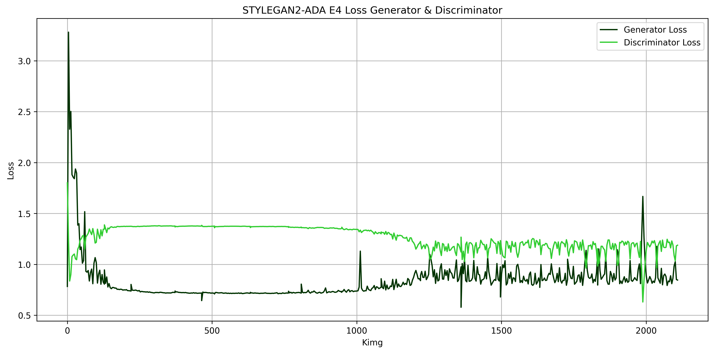
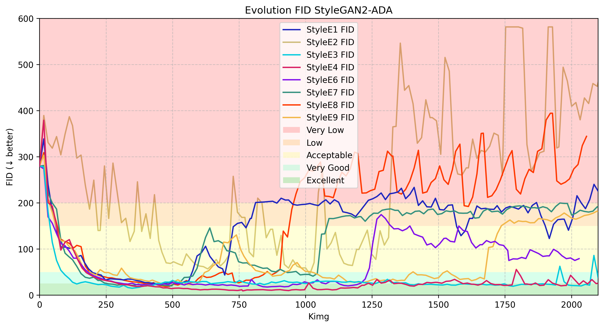
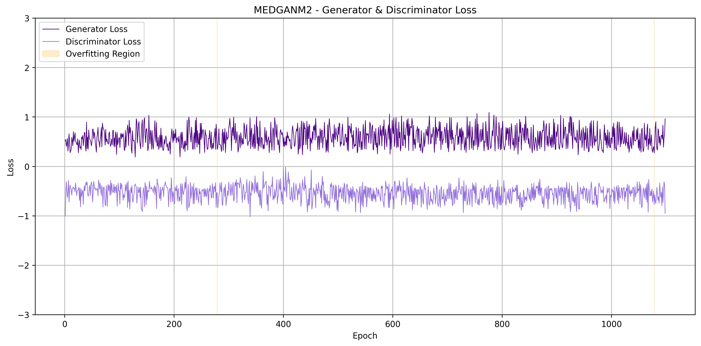
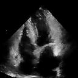
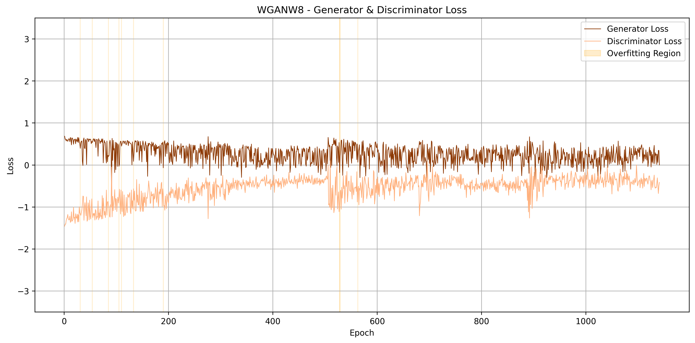
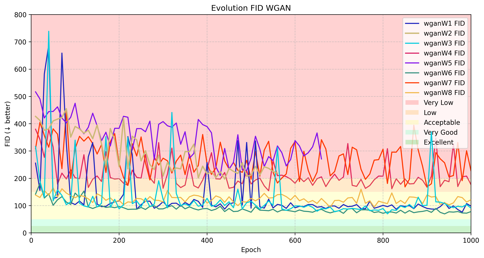
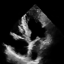
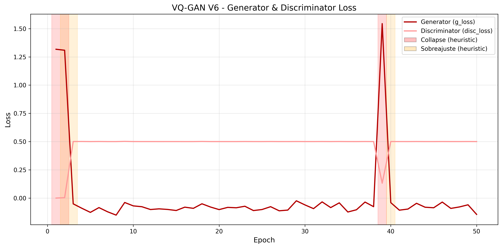
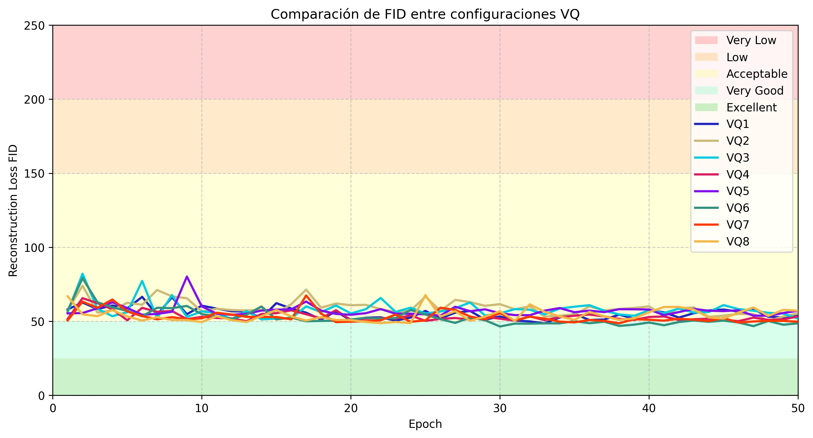
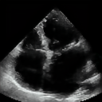

# Echocardiogram Image Generation using Generative Learning Strategies

  

## Related Publications

### Conference Paper (IEEE SIPAIM)

**Comparative Study of Methods for Generating Echocardiographic Images**  
S. Hernández, et al.  
SIPAIM, IEEE, 2025  

  
   
  
   
  

> [!NOTE]
> This article represents the first and most concise version of the research, presenting the results of StyleGAN and MedGAN as generation architectures alongside VQGAN and Pix2Pix as reconstruction architectures. 

### Thesis (Extended and Robust Study)

**Generación de imágenes de ecocardiogramas mediante estrategias de aprendizaje generativo**  
Salomón Hernández Velandia  
(Thesis manuscript – not yet formally published)

> [!IMPORTANT]
> The thesis significantly extends the SIPAIM publication by incorporating additional architectures, deeper experimental analysis, and a more comprehensive evaluation framework.

A preprint version of the thesis is available in the `publications/thesis/` directory.

---

## Table of Contents

- [Echocardiogram Image Generation using Generative Learning Strategies](#echocardiogram-image-generation-using-generative-learning-strategies)
  - [Related Publications](#related-publications)
    - [Conference Paper (IEEE SIPAIM)](#conference-paper-ieee-sipaim)
    - [Thesis (Extended and Robust Study)](#thesis-extended-and-robust-study)
  - [Table of Contents](#table-of-contents)
  - [Tech Stack](#tech-stack)
  - [Research Context](#research-context)
  - [Configuration](#configuration)
    - [Dataset and Preprocesing](#dataset-and-preprocesing)
    - [Train](#train)
    - [TResultsn](#results)
  - [Best Architecture](#best-architecture)
    - [Best Configuration](#best-configuration)
  - [Plus Colab](#pluscolab)
  - [Acknowledgments](#acknowledgments)

## Tech Stack

This repository contains the code, experimental setup, and results associated with the research project:

**"Generación de imágenes de ecocardiogramas mediante estrategias de aprendizaje generativo"**

This work was developed as a thesis project and extends previous research published at SIPAIM (IEEE), exploring multiple generative architectures for synthetic echocardiographic image generation.

---

## Research Context

The generation of synthetic echocardiographic images is an effective alternative for data augmentation, avoiding the limitations of traditional data augmentation techniques such as affine transformations, which can alter, distort, or falsify medical images and cause critical spatial errors. By using generative models such as GANs, it is possible to create entirely new and diverse images that preserve anatomical and morphological properties, facilitating the comparative evaluation of algorithms and the study of reproducibility in this field of medical imaging.

This project presents a comprehensive comparative study of different generative architectures applied to apical four-chamber echocardiography, the objective is to expand and diversify the available datasets, identify the most efficient model and configuration for generating new images, and thus enrich the resources dedicated to the analysis of cardiac function.

### The architectures explored include:
- StyleGAN2-ADA
- MedGAN
- WGAN
- VQGAN

Each architecture was evaluated under eight different hyperparameter configurations and training strategies, the process included preprocessing the Echonet-Dynamic dataset, which consisted of converting it to grayscale, resizing it to 128×128 pixels, leveraging a power of 2 to optimize calculations in the GANs, binarization to extract the frames corresponding to diastole and systole for each patient, and selecting the first and last frames of each sequence to diversify the training data. All of this processing can be found in `src/preprocessing/extractionframes.py`

---

## Configuration

### Dataset and Preprocesing

The dataset used for all training experiments is EchoNet-Dynamic, provided by Stanford University, which is publicly available at:
https://echonet.github.io/dynamic/index.html#dataset

To ensure data consistency across experiments, a preprocessing pipeline was applied, implemented in `src/preprocessing/extractionframes.py`.
- The following steps were performed:
- Extraction of frames from the 10,000 echocardiography videos in the original dataset.
- Conversion of frames to grayscale.
- Application of a mask to remove irrelevant background information.
- Rescaling of images to a resolution of 128 × 128 pixels.
- Detection of diastole and systole phases for each patient by applying image binarization and pixel counting.
- Extraction of: Frames corresponding to diastole and systole, the first and last frame of each video.

This process enriched the dataset, resulting in a total of 40,120 processed images.

For visualization purposes, mask application can be inspected in
`src/preprocessing/visualizcion_mask.py`, binarization results can be inspected in `src/preprocessing/visualization_binarizacion.py`

If you plan to work in Google Colab, the script `src/preprocessing/convertirZIP.py` can be used to quickly compress and transfer the preprocessed dataset as a ZIP file.

### Train

The `./training` directory contains one Jupyter Notebook per implemented GAN architecture, each notebook includes the necessary code to:
- Train the corresponding model
- Save model checkpoints
- Compute evaluation metrics
- Generate images for a selected training epoch

Specific notes:
- `./training/MedGAN.ipynb` and `./training/WGAN.ipynb` require external modules located in `./src/medgan`.
- `./training/StyleGan2_Ada.ipynb` contains a wrapper that calls the official StyleGAN2-ADA implementation.
To use it, the official repository must be cloned inside the `./external` directory, a dedicated README with cloning instructions is provided in that folder.

### Results

All training results for the implemented architectures are stored in the `./experiments` directory, within `./experiments`, there is one folder per architecture, each architecture folder contains eight subfolders, corresponding to the different training configurations evaluated, inside each configuration folder, the following structure is used:

- `checkpoints/` Stores the most relevant model checkpoints obtained during training.
  - `StyleGAN2-ADA`: checkpoints are saved in .pkl format
  - Other architectures: checkpoints are saved in .pth format

- `generated_samples/` Contains generated images saved every 25 training epochs, allowing visual inspection of model progression.

- `metrics_csv/` Stores CSV files with quantitative results computed at fixed training intervals, including:
  - Generator loss
  - Discriminator loss
  - FID
  - KID
  - JSD
  - SSIM
  - PSNR
  - LPIPS

For visualization of results, all result visualizations are stored in the `./results` directory, within this directory, each architecture has its own folder containing: Training loss curves, line plots of evaluation metrics, radar charts, violin plots. These visualizations provide a clearer and more intuitive comparison of model performance across architectures and training configurations.

---

## Best Architecture

| Architecture | Losses | FID Curve | Generated Sample |
|-------------|--------|-----------|------------------|
| **StyleGAN2** E4|   |  |  |
| **MedGAN**  M2      |  |             |  |
| **WGAN**      W8    |           |            |  |
| **VQGAN**     VQ6    |         |          |  |

---

### Best Configuration

The best configuration obtained corresponds to StyleGAN2-ADA (E4), which achieved a FID of 9.18, the best performance among all the architectures evaluated.
From this configuration, a dataset of 10,000 synthetic images was generated using the control point corresponding to epoch 764, with the optimal hyperparameters identified during training.
The generated images can be found in the following directory: `.\experiments\stylegan2_ada\E4\best_generated`.

  

---

## Plus Colab

For a quick deployment in Google Colab, it is recommended to use only the files contained in the colab/ directory.
This folder includes dedicated Jupyter notebooks that allow: Extraction of images from the downloaded ZIP dataset, independent implementation and training of each GAN architecture, with one Jupyter notebook per model.

This setup enables a streamlined workflow for rapid experimentation without requiring the full local repository structure.

  <!-- GitHub Repo -->
  <!--  -->

  <!-- LinkedIn -->
  

## Acknowledgments

I am grateful to the Nueva Granada Military University and, especially, to the National University of Colombia, for providing me with the necessary institutional and financial support to develop this project. I am also grateful to my professor, Dr. Alexander Cerón Correa, who oversaw this work, and my deepest gratitude to my mentor, Dr. Hilda Marcela Iregui Guerrero, who opened the doors of her ACCEDER research group to me and dedicated an invaluable part of her time to teaching me the algebraic and statistical foundations of machine learning.

