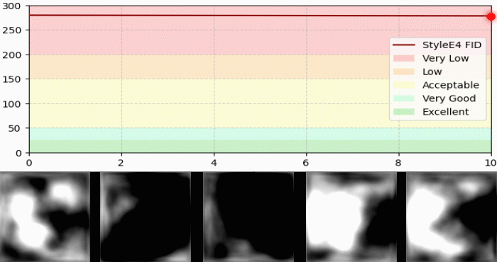

# Echocardiogram Image Generation using Generative Learning Strategies

<p align="center">
  
</p>

This repository contains the code, experimental setup, and results associated with the research project:

**"Generación de imágenes de ecocardiogramas mediante estrategias de aprendizaje generativo"**

This work was developed as a thesis project and extends previous research published at SIPAIM (IEEE), exploring multiple generative architectures for synthetic echocardiographic image generation.

---

## 🔬 Research Context

The generation of synthetic echocardiographic images can support data augmentation, algorithm benchmarking, and research reproducibility in medical imaging.  
This project provides a comparative and in-depth study of generative models applied to echocardiography.

### Architectures explored include:
- StyleGAN2-ADA
- VQGAN
- Additional generative architectures explored in the thesis (4 additional models)

Each architecture was evaluated under multiple configurations and training strategies.

---

## 📚 Related Publications

### Conference Paper (IEEE SIPAIM)

**Comparative Study of Methods for Generating Echocardiographic Images**  
S. Hernández Velandia, et al.  
SIPAIM, IEEE, 2025  

- IEEE Xplore: https://ieeexplore.ieee.org/document/11283212  
- DOI: https://doi.org/10.1109/SIPAIM67325.2025.11283212  
- Preprint: https://www.researchgate.net/publication/398847593

> This paper represents the first and most concise version of the research.

---

### Thesis (Extended and Robust Study)

**Generación de imágenes de ecocardiogramas mediante estrategias de aprendizaje generativo**  
Salomón Hernández Velandia  
(Thesis manuscript – not yet formally published)

> The thesis significantly extends the SIPAIM publication by incorporating additional architectures, deeper experimental analysis, and a more comprehensive evaluation framework.

A preprint version of the thesis is available in the `publications/thesis/` directory.

---

## 🗂️ Repository Structure

```text
ecocardiogram-gan-thesis/
│
├── README.md
├── LICENSE
├── LICENSE_DATA
├── CITATION.cff
├── requirements.txt
|
├── experiments/
│   ├── stylegan2_ada/
│   │   ├── E1/
│   │   │   ├── checkpoints/
│   │   │   │   └── .....pth
│   │   │   ├── generated_samples/
│   │   │   │   ├── generated_0.png
│   │   │   │   └── generated_25.png
│   │   │   ├── metrics_csv/
│   │   │   │   ├── metrics.csv
│   │   │   │   └── losses.csv
│   │   │   └── samples/
│   │   │
│   │   ├── E2/
│   │   ├── E3/
│   │   └── E4/
│   │
│   ├── medgan/
│   │   ├── M1/
│   │   └── ...
│   │
│   ├── wgan/
│   │   └── ...
│   │
│   └── vqgan/
│       └── ...
│
├── external/
│   ├── README.md
│   └── stylegan2-ada/   # submodule o instrucción de clonación
│
├── publications/
│   ├── sipaim/
│   └── thesis/
│
├── training/
│   ├── StyleGan2_Ada.ipynb
│   ├── MedGAN.ipynb
│   └── WGAN.ipynb
│
├── src/
│   ├── medgan/
│   │   ├── dcgan.py
│   │   ├── mlp.py
│   │   └── dztaset.py
│   |
│   ├── preprocessing/
│   │   ├── comprobacion_sistole.py
│   │   ├── convertirZIP.py
│   │   ├── extractionframes.py
│   │   ├── visualizacion_mask.py
│   │   └── visualizacion_binarizacion.py
│   │
├── results/
│   ├── stylegan2_ada/
│   |   ├── line_graph/
│   |   ├── losses/
│   |   ├── radar_graph/
│   |   └── violin_boxplot_graph/
│   |
│   ├── medgan/
│   |   ├── line_graph/
│   |   ├── losses/
│   |   ├── radar_graph/
│   |   └── violin_boxplot_graph/
│   |
│   ├── wgan/
│   |   ├── line_graph/
│   |   ├── losses/
│   |   ├── radar_graph/
│   |   └── violin_boxplot_graph/
│   |
│   └── vqgan/
│       ├── line_graph/
│       ├── losses/
│       ├── radar_graph/
│       └── violin_boxplot_graph/
│   


├── configs/                # Configuration files for different architectures and experiments
├── generated_samples/      # Synthetic echocardiographic images
├── checkpoints/            # Trained model checkpoints (if applicable)
├── publications/           # Thesis and paper preprints
├── external/               # External repositories (e.g., StyleGAN2-ADA, VQGAN)
├── scripts/                # Utility scripts for setup, training, and evaluation
